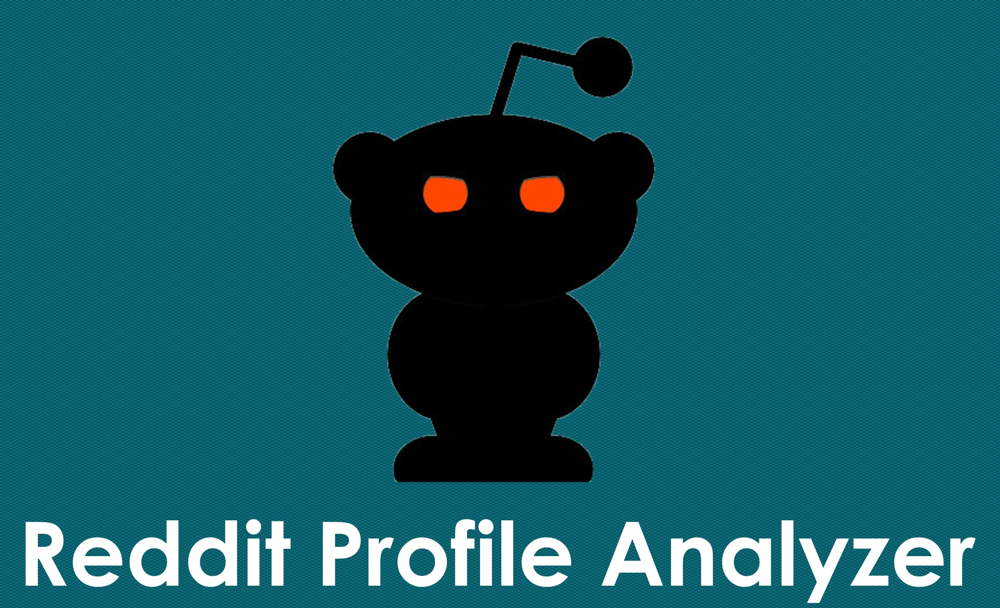
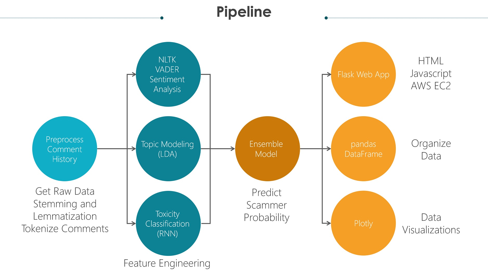
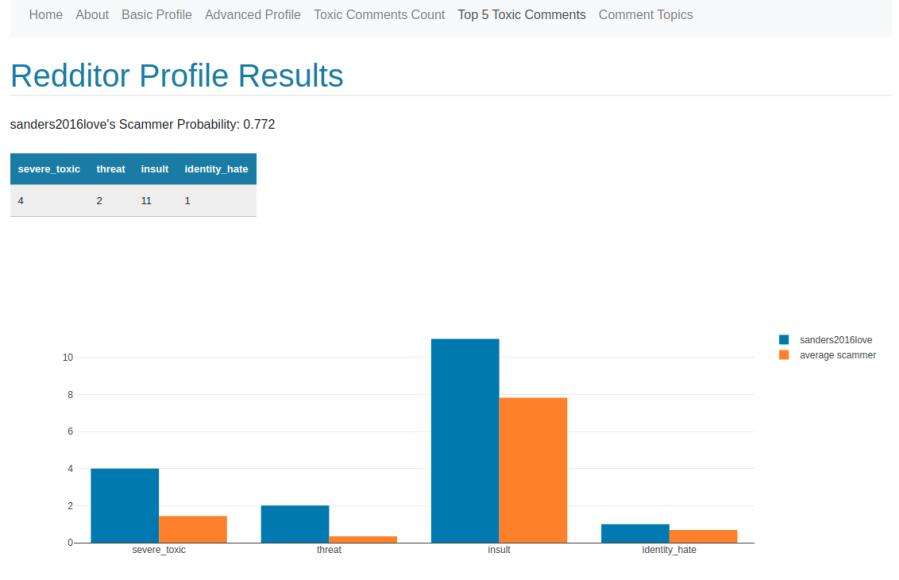
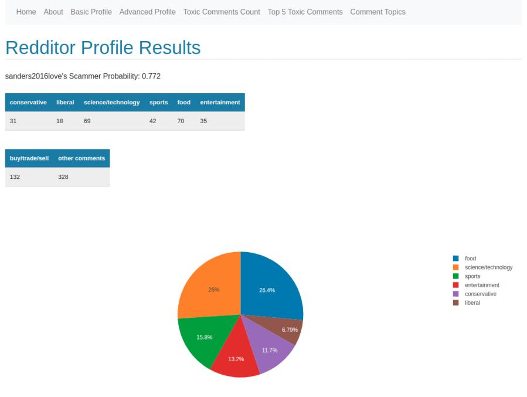

# RedditProfileAnalyzer

## Introduction

Reddit is one of my go to spots for buying and selling used goods, especially when you're looking for something specific. It might be nerve-wracking exchanging cash or goods with an online stranger when you don't know anything about them, especially when there are people that are actively trying to scam you.

This tool will assist with creating a quick profile of the user you are interacting with as well as give you a probability of them being a scammer to help you make a decision if you want to exchange goods, services, or currency with this user.

The profile analyzer can also be used as a public relations tool to help clean up a  Reddit profile's comment history. For example, if you're a person that is doing an ask me anything session on your personal account, you might have some questionable or head scratching comments you made 5 or 10 years that you forgot about and might want to scrub before people find it and post all over the internet.

## Background

So on creating the dataset for exploratory data analysis and training, there isn't a database with labeled scammers and non-scammers with corresponding data on them, so I had to synthesize one. I start by using the [universal scammer list](universalscammerlist.com), which is a collaboration between 60 subreddits on reporting and listing scammers on Reddit. I scrape all the listed banned users there for my scammer group, and then I scrape active users from the 60 subreddits participating in the USL as my non-scammer group.

For my ensemble method used to predict scammers, training and validation was done with said dataset. More information can be found in this [repo](https://github.com/chanrl/RedditScammerDetector). Additionally, I had to feature engineer some items using the following tools: 

| Technology      | Use |
|------------|-------------|
| NLTK's Vader Sentiment Analyzer |  Categorize comments as positive, neutral, or negative sentiment |
| Recurrent Neural Network | Categorize comments based on their toxicity type, trained on a [Kaggle dataset](https://www.kaggle.com/c/jigsaw-toxic-comment-classification-challenge) | 
| Gensim Latent Dirichlet Allocation | Topic Modeling |

## Flask Pipeline

1. Get Raw Data
2. Preprocess comment history
    * Perform stemming and lemmatization
    * Tokenize comments and pad sequences
3. Pass processed data into ensemble model (Random Forest, LightGBM, XGBoost) for scammer probability prediction
4. Output data and results on Flask Web App

## Web App

A demo web app is available for public use [here](http://3.133.79.156/) from 9:30 AM - 6:00 PM PST

## Files to download

If you would like to run this locally, the ensemble classifier and toxicity classifer would need to be downloaded.

| Model      | Requirements |
|------------|-----|
|**[Toxicity Classifier](https://reddit-scammer-detector.s3-us-west-1.amazonaws.com/my_model.h5)** | Tensorflow==2.0.0 |
|**[Ensemble Classifier](https://reddit-scammer-detector.s3-us-west-1.amazonaws.com/eclf.pkl)** | scikit-learn==0.21.3 |

